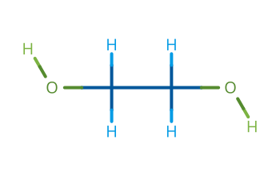
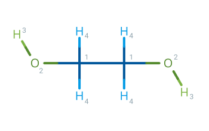
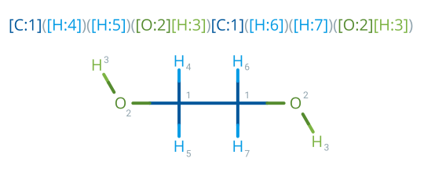

(resp_chapter)=
# RESP charges

The OpenFF Recharge framework supports generating RESP{cite}`bayly1993well` charges for molecules in multiple conformers
in addition to providing the tools needed to fit 'charge correction' type models such as AM1BCC.

A full overview of the RESP fitting procedure as implemented *in this framework* is given here, while a full code
example for computing RESP charges can be found [in the examples folder].

[in the examples folder]: https://github.com/openforcefield/openff-recharge/tree/main/examples/resp-charges

## Assigning topological symmetry

Atoms in the molecule of interest are initially partitioned into four different categories:

These classifications will determine which atoms will be constrained to have equivalent charges during each stage
of the RESP procedure.

:::{figure-md} fig-fragments
:align: center
:width: 350px

Atoms are either assigned a category of methyl(ene) carbon / hydrogen (blue) or other (green)
:::

Further, each atom in the molecule is assigned a *symmetry group*. Atoms with the same symmetry group are considered
to be topologically symmetrical and would, in general, be expected to be assigned the same partial charge.

:::{figure-md} fig-fragments
:align: center
:width: 350px

Topologically symmetrical atoms are grouped by index
:::

Symmetry groups are assigned user either the RDKIT `CanonicalRankAtoms` function with `breakTies=False` or the
OpenEye `OEPerceiveSymmetry` functions depending on which toolkit is installed. A preference is given to using OpenEye
if both toolkits are installed.

## Creating a charge parameter

RESP charges are represented within the framework as a [library charge parameter](library_charge_section); namely, as
both a mapped SMILES pattern and a list of corresponding charges. Encoding which values map to which atoms in the
molecule into a SMILES pattern allows us to both easily define the exact molecule that the RESP charges should be
applied to, as well tp define which atoms must have equivalent charges.

The created SMILES pattern is required to explicitly contain **all** atoms in the molecule, i.e. no implicit hydrogens
or partial matches, and every one of those explicit atoms must have an accompanying map index. These map indices need
not be unique, but rather, any atoms that have the same map index will be assigned the exact same partial charge from a
corresponding vector of values

$$ \mathbf{x}_{resp} =
  \begin{bmatrix} x_{1} & \dots & x_{n_{resp}} \end{bmatrix}^\intercal
$$

where here $n_{resp}$ corresponds to the total number of *unique* charges, rather than the number of atoms in the
molecule $N$. As is described in the [theory chapter](applying_models_section), this vector of *unique* charges is
mapped into a vector on $N$ atomic charges through the construction of an *assignment matrix*.

As an example, consider again 1,2-Ethanediol. If we wish to enforce that all heavy atoms and non-methyl(ene) hydrogens
should have equivalent charges within their respective symmetry groups, but enforce no such constraint on methyl(ene)
hydrogens as one might in stage one of the RESP procedure, the corresponding SMILES pattern would look like

:::{figure-md} fig-fragments
:align: center
:width: 540px

A SMILES pattern encoding which atoms should have which charge
:::

where the two methyl carbons, hydroxyl oxygens, hydroxyl hydrogens are all assigned to their respective symmetry groups,
while the remaining methyl hydrogens have been assigned to different groups as desired. The corresponding charges for
each atom in the molecule $\mathbf{q}_{resp}$, could then be computed as

$$
\mathbf{q}_{resp}=
\begin{bmatrix}
    1 & 0 & 0 & 0 & 0 & 0 & 0 \\
    1 & 0 & 0 & 0 & 0 & 0 & 0 \\
    0 & 1 & 0 & 0 & 0 & 0 & 0 \\
    0 & 1 & 0 & 0 & 0 & 0 & 0 \\
    0 & 0 & 1 & 0 & 0 & 0 & 0 \\
    0 & 0 & 1 & 0 & 0 & 0 & 0 \\
    0 & 0 & 0 & 1 & 0 & 0 & 0 \\
    0 & 0 & 0 & 0 & 1 & 0 & 0 \\
    0 & 0 & 0 & 0 & 0 & 1 & 0 \\
    0 & 0 & 0 & 0 & 0 & 0 & 1 \\
\end{bmatrix}
\begin{bmatrix}
   x_1 \\ x_2 \\ x_3 \\ x_4 \\ x_5 \\ x_6 \\ x_7
\end{bmatrix}
$$

for example where here an atom ordering of *\[C, C, O, O, HO, HO, H, H, H, H\]* is assumed.

## Defining the loss function

The loss function that must be minimized during the RESP procedure can be defined as the sum of two terms

$$
  \chi^2 \left( \mathbf{x}_{resp} \right) =
      \chi_{esp}^2 \left( \mathbf{x}_{resp} \right)
    + \chi_{restr}^2 \left( \mathbf{x}_{resp} \right)
$$

The first term $\chi_{esp}^2$, penalizes deviations of the predicted ESP from a set of reference QC ESP values
$\mathbf{b}$

$$
    \chi_{esp}^2 \left( \mathbf{x}_{resp} \right) = \left|| \mathbf{A}\mathbf{x}_{resp} - \mathbf{b} \right||_2^2
$$

where here $\mathbf{A}$ is the design matrix defined fully in the [theory chapter](train_to_qc_section) that encodes
both the inverse distance from each atom to each grid point as well as the assignment matrix that maps from the
equivalized charges $\mathbf{x}_{resp}$ to the full set of charges on each atom in the molecule $\mathbf{q}_{resp}$.

The second term $\chi_{restr}^2$, corresponds to a hyperbolic penalty for deviations of $\mathbf{x}_{resp}$ away from
zero

$$
    \chi_{restr}^2 \left( \mathbf{x}_{resp} \right) = a \sum^{N_{heavy}}_{j} \left( x_j^2 + b^2 \right)^{\frac{1}{2}} - b
$$

where $N_{heavy}$ is the total number of heavy atoms (both methyl(ene) and non-methyl(ene)), and $a$ and $b$ control
the strength and tightness of the hyperbolic restraint respectively.

It is critical that $\chi^2$ is minimized subject to the constraint that the sum of the partial charge on each atom is
equal to the total charge on the molecule of interest. This constraint can be succinctly written in matrix form as

$$
    \mathbf{C}\mathbf{x}_{resp}=\mathbf{d}
$$

where $\mathbf{C} \in \mathbb{R} ^ {1 \times n_{resp}}$ and

$$
    C_{1k} = \sum_j^{N}T_{jk}
$$

forms the constraint matrix, $\mathbf{T}$ the library charge assignment matrix defined in the
[theory chapter](applying_models_section), and $\mathbf{d} = \begin{bmatrix} Q \end{bmatrix}$
is a vector containing the total charge on the molecule $Q$.

## Two stage RESP

The RESP procedure proceeds in two stages, whereby the differences between the two stages are

* which atoms will have their charges constrained to be equivalent (equivalized) both within the *same* conformer and
  *between* different conformers
* which atoms will be trained and which atoms will be kept fixed
* and finally, the strength of the hyperbolic restraint applied to heavy atoms in the molecule.

The exact choices made within this framework for each of these questions are summarised in the below table

and are based upon the original RESP publications {cite}`bayly1993well,cieplak1995application,cornell2002application`.

Within each stage the set of charges that minimize $\chi^2$ subject to the total charge constraint must be solved.
As the loss function is non-linear, this is more involved than simply applying the normal method for solving linear
systems of equations.

There are currently two main approaches available in the framework to do this: through the construction of a non-linear
lagrangian function that is solved iteratively, or using one of the minimizers built-in to the [SciPy package].

(minimizing_iteratively_subsection)=
### Minimizing iteratively

The original RESP papers proposed finding a set of charges that minimize $\chi^2$ by first constructing a lagrangian
function

$$
    \mathcal{L} \left( \mathbf{x}_{resp}, \lambda \right)=
        \chi^2 \left( \mathbf{x}_{resp} \right) + \lambda \left( \mathbf{C} \mathbf{x}_{resp} - \mathbf{d} \right)
$$

where $\lambda$ is the lagrange multiplier, and then attempting to solve for

$$
\dfrac{\text{d} \mathcal{L}}{\text{d} \mathbf{x}_{resp}} = 0
\mathrm{\;\;and\;\;}
\dfrac{\text{d} \mathcal{L}}{\text{d} \lambda} = 0
$$

namely by solving

$$
    \begin{bmatrix}
        \mathbf{A}^\intercal\mathbf{A} + \mathbf{B} & \mathbf{C}^\intercal \\ \mathbf{C} & \mathbf{0}
    \end{bmatrix}
    \begin{bmatrix}
        \mathbf{x}_{resp} \\ \lambda
    \end{bmatrix}
        =
    \begin{bmatrix}
        \mathbf{A}^\intercal\mathbf{b} \\ \mathbf{d}
    \end{bmatrix}
$$

where

$$
    \mathbf{B} =
    \begin{bmatrix}
        \dfrac{a_1}{\sqrt{x_1^2 + b ^ 2}} & \dots  & 0                                                   \\
        \vdots                            & \ddots & \vdots                                              \\
        0                                 & \dots  & \dfrac{a_{n_{resp}}}{\sqrt{x_{n_{resp}}^2 + b ^ 2}} \\
    \end{bmatrix}
$$

and $a_i = a \times C_{1i}$ if $x_i$ corresponds to a value that would be assigned to a heavy atom, or $0$
otherwise.

Following the original RESP paper and corresponding code implementation, the first step in solving the lagrangian
is to generate an initial guess for $\mathbf{x}_{resp}$. This is done by replacing the hyperbolic restraint with
a harmonic one, such that the $\mathbf{B}$ term in the lagrangian is replaced with
$2 \mathbf{I} \odot \begin{bmatrix}a_1 & \dots & a_{n_{resp}}\end{bmatrix}^\intercal$. This reduces the problem to a
linear one, and hence can be readily solved for $\mathbf{x}_{resp,0}$.

This initial guess of $\mathbf{x}_{resp,0}$ is then substituted into $\mathbf{B}$ such that the lagrangian again becomes
linear in $\mathbf{x}_{resp}$, and can be solved for a new value of $\mathbf{x}_{resp,1}$. The process of
recomputing the lagrangian using the latest guess of the charge set, and solving for the next best guess, is repeated
until convergence in the predicted charges is reached. Namely, until

$$

\dfrac{1}{n_{resp}}\|\mathbf{x}_{resp,i-1}-\mathbf{x}_{resp,i}\| < 0.1\times 10^{-5}

$$

### Minimizing with SciPy

The [SciPy package] contains built-in functions for minimizing non-linear loss functions, such as the one defined above,
subject to equality constraints and hence in principle should be able to yield high quality RESP charges with relative
ease.

:::{warning}
This solver is still experimental and may yield different charges than the iterative solver described in the RESP
publication.
:::

An initial guess, $\mathbf{x}_{resp,0}$, is generated in the same fashion as when trying to find a
[solution iteratively](minimizing_iteratively_subsection). This, along with the above loss function and matrix form
equality constraint can then be passed directly to either the *SLSQP* or *trust-constr* minimization methods to yield a
candidate set of charges.

## References

:::{bibliography}
:style: unsrt
:filter: docname in docnames
:::

[SciPy package]: https://docs.scipy.org/doc/scipy/reference/generated/scipy.optimize.minimize.html
